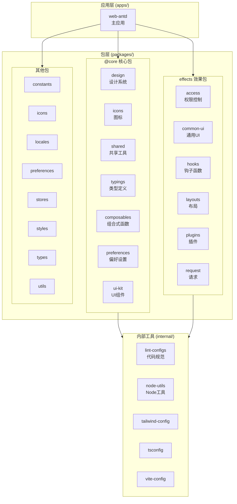

# FastAPI Best Architecture UI

> FastAPI 最佳架构的前端 UI 实现，基于 Vue Vben Admin 5.x 构建

## 项目愿景

为 [FastAPI Best Architecture](https://github.com/fastapi-practices/fastapi_best_architecture) 后端项目提供现代化、可扩展的企业级前端管理界面。

## 技术栈

- **框架**: Vue 3.5+ + TypeScript 5.8+
- **UI 库**: Ant Design Vue 4.x
- **构建工具**: Vite 6.x + Turbo (Monorepo)
- **包管理**: pnpm 10.x (workspace)
- **状态管理**: Pinia 3.x
- **路由**: Vue Router 4.x
- **样式**: TailwindCSS 3.x + SCSS
- **HTTP 客户端**: Axios
- **国际化**: Vue I18n

## 架构总览



## 模块索引

| 模块        | 路径                        | 说明                    |
| ----------- | --------------------------- | ----------------------- |
| web-antd    | `apps/web-antd/`            | 主应用 (Ant Design Vue) |
| @core       | `packages/@core/`           | 核心基础包              |
| effects     | `packages/effects/`         | 功能效果包              |
| stores      | `packages/stores/`          | 状态管理                |
| request     | `packages/effects/request/` | HTTP 请求封装           |
| locales     | `packages/locales/`         | 国际化                  |
| icons       | `packages/icons/`           | 图标资源                |
| preferences | `packages/preferences/`     | 偏好设置                |
| internal    | `internal/`                 | 构建/lint 配置          |

## 快速开始

```bash
# 安装依赖
pnpm install

# 开发模式
pnpm dev:antd

# 构建
pnpm build:antd

# 类型检查
pnpm check:type

# 代码检查
pnpm lint
```

## 全局规范

### 代码风格

- ESLint + Prettier 统一格式化
- Stylelint 样式规范
- Commitlint 提交规范 (Conventional Commits)

### 目录约定

- `api/` - API 接口定义
- `views/` - 页面视图
- `plugins/` - 插件模块 (可插拔功能)
- `store/` - 状态管理
- `router/` - 路由配置
- `locales/` - 国际化资源

### API 规范

- 基础路径: `/api/v1/`
- 响应格式: `{ code: 200, data: T, msg: string }`
- Token: Bearer JWT

### 环境变量

- `.env` - 通用配置
- `.env.development` - 开发环境
- `.env.production` - 生产环境

## 后端 API 地址

开发环境默认: `http://localhost:8000`

## 数据库快捷查询

当需要查询数据库时（如查看菜单表、检查数据等），直接执行以下命令：

```bash
python scripts/db_query.py "<SQL或表名>"
```

**常用示例：**
- `python scripts/db_query.py sys_menu` - 查看菜单表
- `python scripts/db_query.py "SELECT * FROM sys_menu WHERE path LIKE '%detective%'"` - 条件查询
- `python scripts/db_query.py tables` - 列出所有表
- `python scripts/db_query.py "schema sys_menu"` - 查看表结构

**触发关键词：** 当用户提到"查数据库"、"看看表"、"sys_menu"、"菜单表"、"数据库里"等，直接执行查询，无需询问。

## Claude Code 配置

本项目集成了 Claude Code 开发辅助工具，提供自定义命令、代理和自动化钩子。

### 配置结构

```
.claude/
├── commands/                # 自定义命令
│   ├── BMad/                # BMad 敏捷工作流（10 角色 + 23 任务）
│   ├── db.md                # 数据库查询
│   ├── commit.md            # Git 提交
│   ├── review.md            # 代码审查
│   ├── gen/                 # 代码生成
│   │   ├── api.md           # API 接口生成
│   │   ├── view.md          # 页面视图生成
│   │   └── plugin.md        # 插件模块生成
│   └── check/               # 检查命令
│       ├── i18n.md          # 国际化检查
│       └── type.md          # 类型检查
├── agents/                  # 子代理
│   └── vue-expert.md        # Vue 技术专家
├── settings.json            # Hooks 配置
└── settings.local.json      # MCP 服务器配置
```

### 快捷命令

| 命令 | 调用方式 | 用途 |
|------|---------|------|
| `/commit` | 直接调用 | 生成规范 Git 提交 |
| `/review` | `/review [path]` | 代码审查 |
| `/gen__api` | `/gen__api 模块名` | 生成 API 接口 |
| `/gen__view` | `/gen__view 页面名` | 生成页面视图 |
| `/gen__plugin` | `/gen__plugin 插件名` | 生成插件模块 |
| `/check__i18n` | 直接调用 | 国际化检查 |
| `/check__type` | 直接调用 | TypeScript 检查 |
| `/db` | `/db SQL或表名` | 数据库查询 |

### BMad 敏捷工作流

项目集成了 BMad 敏捷开发框架，提供完整的角色和任务系统：

**角色代理**：`/dev`、`/qa`、`/pm`、`/po`、`/architect`、`/analyst`、`/sm`、`/ux-expert`

**常用任务**：`/create-next-story`、`/apply-qa-fixes`、`/document-project`

### 技术规范文档

BMad `dev` 角色启动时自动加载以下文档：
- `docs/architecture/coding-standards.md` - 编码规范
- `docs/architecture/tech-stack.md` - 技术栈说明
- `docs/architecture/source-tree.md` - 源码结构

### Hooks 自动防护

自动拦截危险命令：
- `rm -rf *`
- `git reset --hard *`
- `git push --force *`

### MCP 服务器

- **PostgreSQL**: 数据库直连查询

## 相关链接

- [官方文档](https://fastapi-practices.github.io/fastapi_best_architecture_docs/frontend/summary/quick-start.html)
- [后端仓库](https://github.com/fastapi-practices/fastapi_best_architecture)
- [Vben Admin](https://www.vben.pro/)
