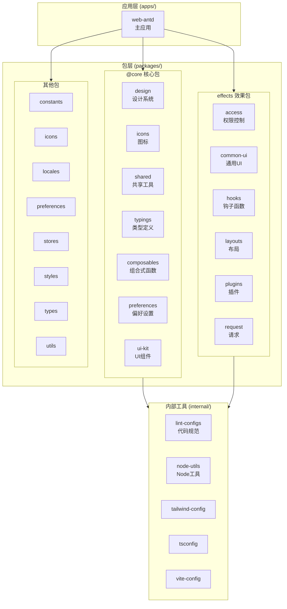

# FastAPI Best Architecture UI

> FastAPI 最佳架构的前端 UI 实现，基于 Vue Vben Admin 5.x 构建

## 项目愿景

为 [FastAPI Best Architecture](https://github.com/fastapi-practices/fastapi_best_architecture) 后端项目提供现代化、可扩展的企业级前端管理界面。

## 技术栈

- **框架**: Vue 3.5+ + TypeScript 5.8+
- **UI 库**: Ant Design Vue 4.x
- **构建工具**: Vite 6.x + Turbo (Monorepo)
- **包管理**: pnpm 10.x (workspace)
- **状态管理**: Pinia 3.x
- **路由**: Vue Router 4.x
- **样式**: TailwindCSS 3.x + SCSS
- **HTTP 客户端**: Axios
- **国际化**: Vue I18n

## 架构总览



## 模块索引

| 模块        | 路径                        | 说明                    |
| ----------- | --------------------------- | ----------------------- |
| web-antd    | `apps/web-antd/`            | 主应用 (Ant Design Vue) |
| @core       | `packages/@core/`           | 核心基础包              |
| effects     | `packages/effects/`         | 功能效果包              |
| stores      | `packages/stores/`          | 状态管理                |
| request     | `packages/effects/request/` | HTTP 请求封装           |
| locales     | `packages/locales/`         | 国际化                  |
| icons       | `packages/icons/`           | 图标资源                |
| preferences | `packages/preferences/`     | 偏好设置                |
| internal    | `internal/`                 | 构建/lint 配置          |

## 快速开始

```bash
# 安装依赖
pnpm install

# 开发模式
pnpm dev:antd

# 构建
pnpm build:antd

# 类型检查
pnpm check:type

# 代码检查
pnpm lint
```

## 全局规范

### 代码风格

- ESLint + Prettier 统一格式化
- Stylelint 样式规范
- Commitlint 提交规范 (Conventional Commits)

### 目录约定

- `api/` - API 接口定义
- `views/` - 页面视图
- `plugins/` - 插件模块 (可插拔功能)
- `store/` - 状态管理
- `router/` - 路由配置
- `locales/` - 国际化资源

### API 规范

- 基础路径: `/api/v1/`
- 响应格式: `{ code: 200, data: T, msg: string }`
- Token: Bearer JWT

### 环境变量

- `.env` - 通用配置
- `.env.development` - 开发环境
- `.env.production` - 生产环境

## 后端 API 地址

开发环境默认: `http://localhost:8000`

## 相关链接

- [官方文档](https://fastapi-practices.github.io/fastapi_best_architecture_docs/frontend/summary/quick-start.html)
- [后端仓库](https://github.com/fastapi-practices/fastapi_best_architecture)
- [Vben Admin](https://www.vben.pro/)
